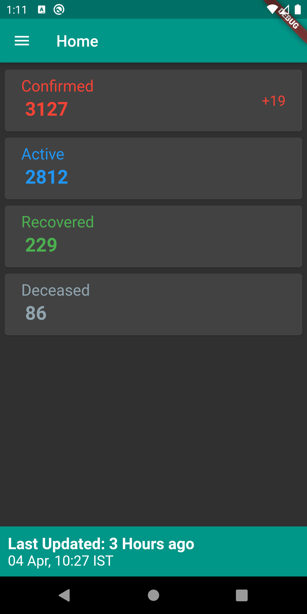
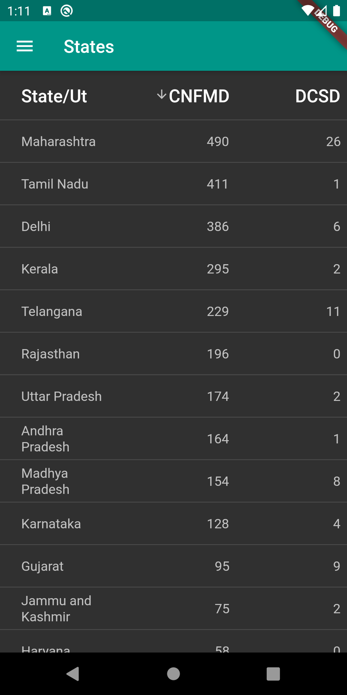
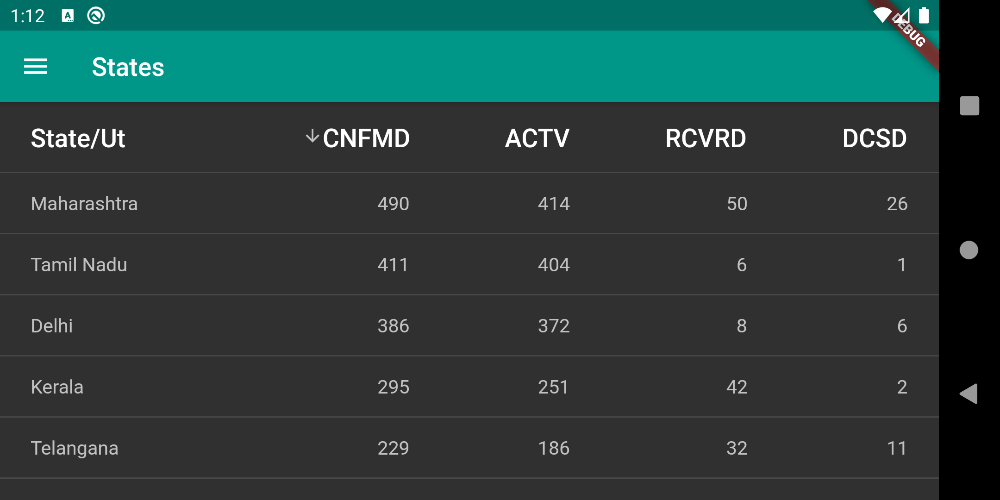
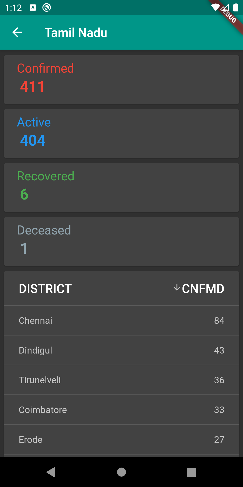
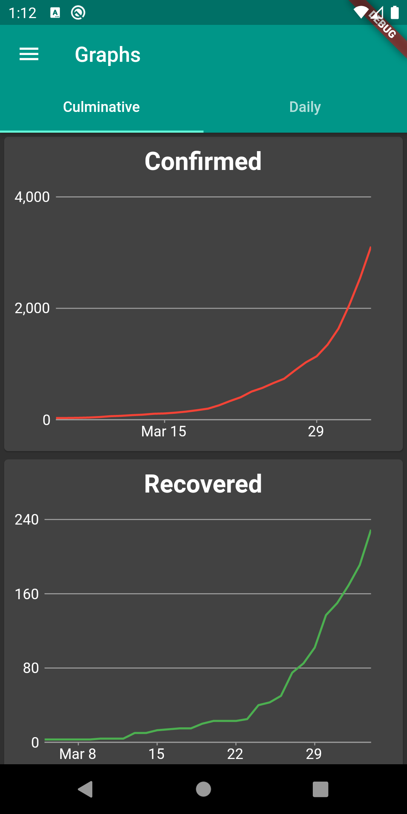
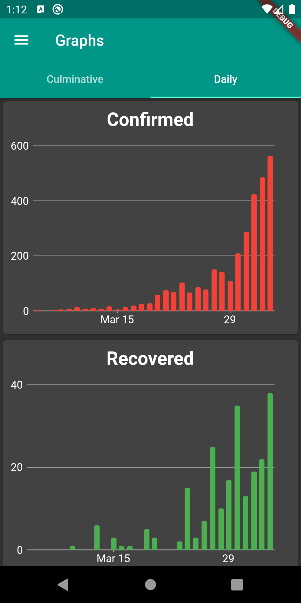

# Coronavirus Status
## Basic
This app uses the same api as the COVID-19 website given in helpful links. I created it because I just wanted an app.
It is influenced heavily by the website so please check it out. This app still lacks some functionality compared to the site but should be sufficient for most people.

## Important Links
[API](https://api.covid19india.org/)  
[Web Interface](https://www.covid19india.org/)

## Screenshots

